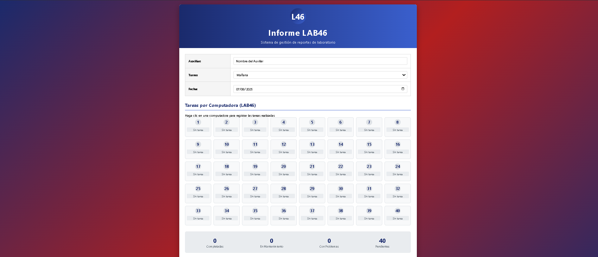

This is a [Next.js](https://nextjs.org) project bootstrapped with [`create-next-app`](https://nextjs.org/docs/app/api-reference/cli/create-next-app).

## Getting Started

First, run the development server:

```bash
npm run dev
# or
yarn dev
# or
pnpm dev
# or
bun dev
```

Open [http://localhost:3000](http://localhost:3000) with your browser to see the result.




### Mejorar el proyecto

posibles componentes:

src/
├── components/
│   ├── Header.tsx
│   ├── InfoTable.tsx
│   ├── ComputersGrid.tsx
│   ├── ComputerCard.tsx
│   ├── StatsContainer.tsx
│   ├── Conclusions.tsx
│   ├── ActionButtons.tsx
│   ├── Footer.tsx
│   ├── Modal.tsx
├── app/
│   ├── page.tsx